

<link rel="icon" href="data:image/svg+xml,<svg xmlns=%22http://www.w3.org/2000/svg%22 viewBox=%220 0 100 100%22><text y=%22.9em%22 font-size=%2290%22>🏖️</text></svg>">

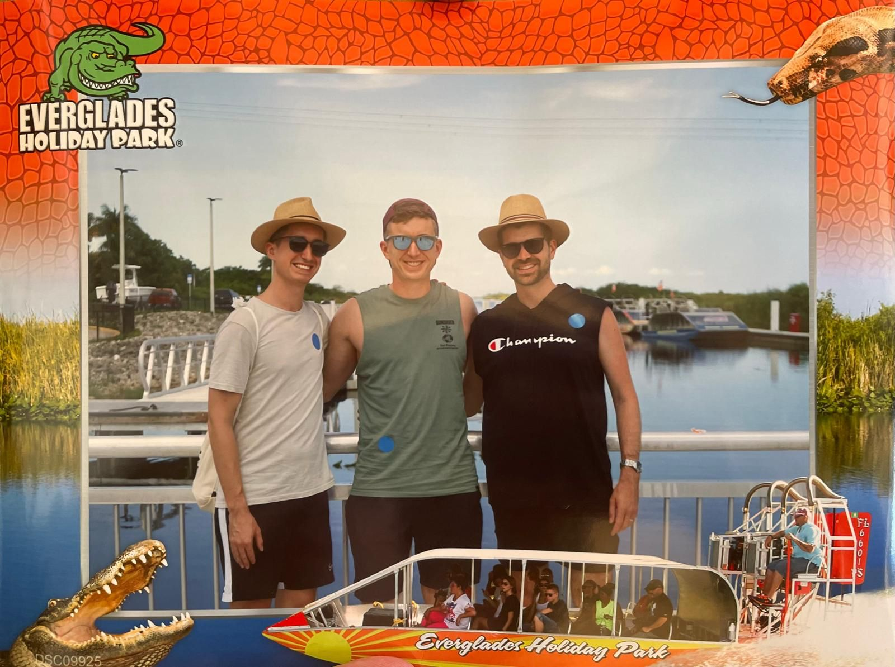

### Overview

**Dates:** 26 Jul – 3 Aug 2024  
**Style:** Coastal loop  
**Transport:** Rental car  
**Start/End:** [Zagreb, Croatia](https://www.google.com/maps/place/Zagreb,+Croatia/)  
**Accommodation:** Motels  
**Vibe:** Scenery, adventure, local food

### Google Maps Route

[Google Maps Route](https://www.google.com/maps/dir/Zagreb,+Croatia/Ljubljana,+Slovenia/Bled,+Slovenia/Bovec,+Slovenia/Postojna,+Slovenia/Trieste,+Italy/Rovinj,+Croatia/Pula,+Croatia/Rijeka,+Croatia/Krk,+Croatia/Zagreb,+Croatia/)
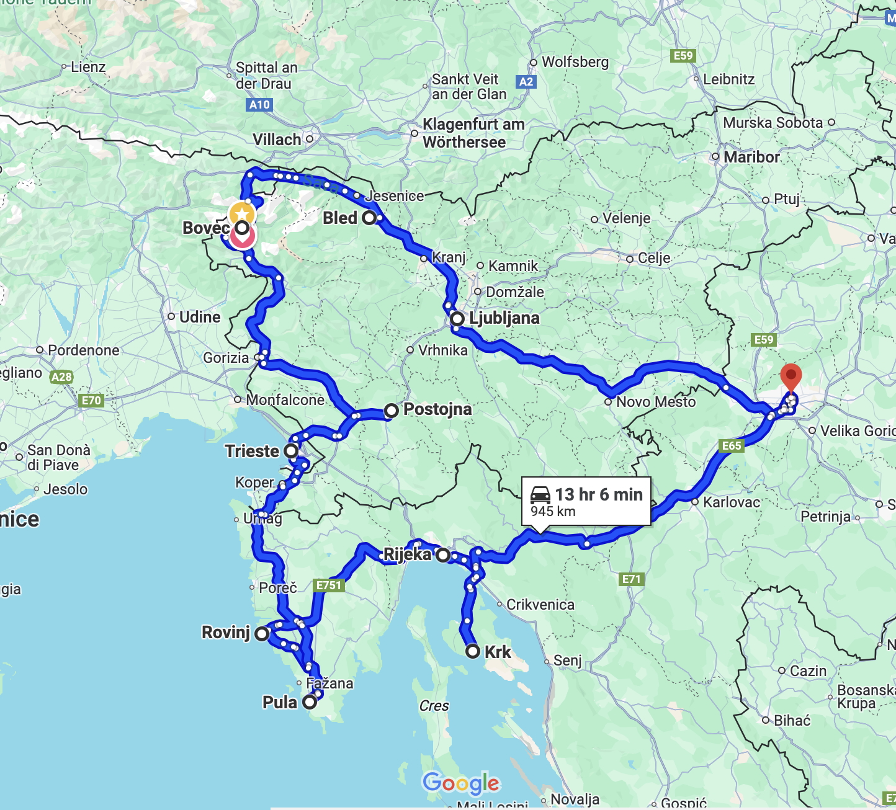

### Flight Details – Basel ↔ [Zagreb](https://www.google.com/maps/place/Zagreb,+Croatia/)

- **Price:** 90.- CHF  
- **Passengers:** 1 Adult

| Date       | Time        | Airline                | Route   | Stops    |
|------------|-------------|------------------------|---------|----------|
| 26 Jul Sat | 13:50–15:20 | Ryanair (Lauda Europe) | BSL–ZAG | Non-stop |
| 3 Aug Sun  | 10:15–11:50 | Ryanair (Lauda Europe) | ZAG–BSL | Non-stop |

### Car Rental – [Zagreb Airport](https://www.google.com/maps/place/Zagreb+Airport/)

[Booking Link](https://cars.booking.com/package/deal/eyJkcml2ZXJzQWdlIjozMC...)

| Item         | Info                            |
|--------------|---------------------------------|
| Vehicle      | VW Taigo or similar SUV         |
| Gear         | Automatic                       |
| Mileage      | Unlimited                       |
| Pickup       | 26 Jul, 10:00                   |
| Return       | 3 Aug, 10:00                    |
| Provider     | Goldcar                         |
| Extras       | Add. driver: 58.88 CHF          |
| Insurance    | Collision & theft (1736 CHF SB) |
| Rating       | 8.6 (400+ reviews)              |
| Price        | 422.06 CHF                      |

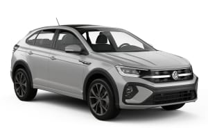

## Route Plan

### **Day 1 – 26 Jul (Sat) – [🌍 Zagreb](https://www.google.com/maps/place/Zagreb,+Croatia/)**

- Car pickup  
- First local beer  
- Overnight in [Zagreb](https://www.google.com/maps/place/Zagreb,+Croatia/)

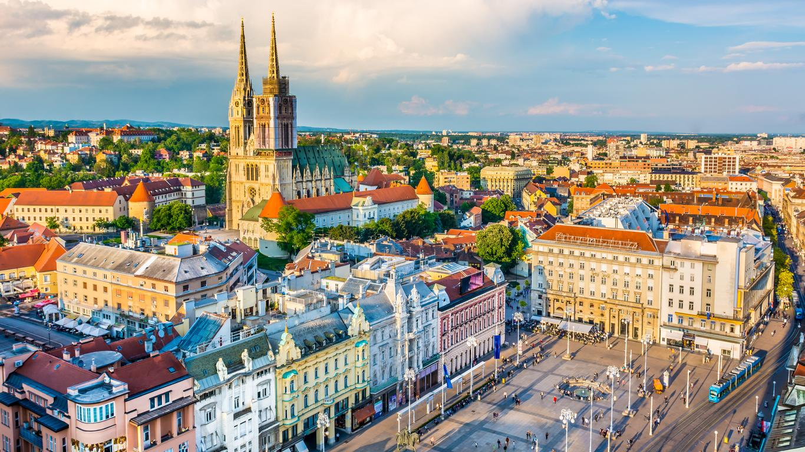

### **Day 2 – 27 Jul (Sun) – [🌍 Ljubljana](https://www.google.com/maps/place/Ljubljana,+Slovenia/)**

- Walk the old town  
- [Shooting Range Gaj](https://shootingrange-gaj.eu/)  
- Overnight in [Ljubljana](https://www.google.com/maps/place/Ljubljana,+Slovenia/)

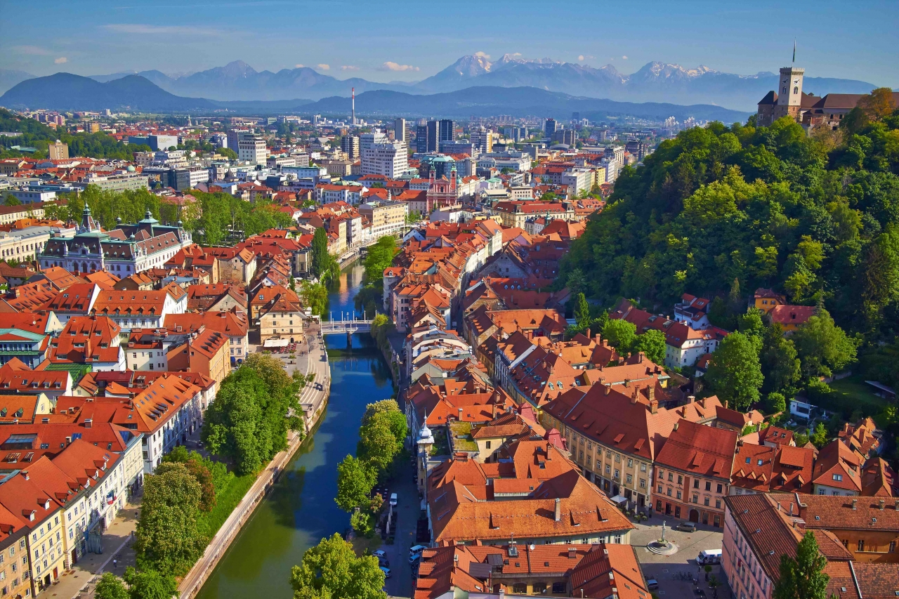

### **Day 3 – 28 Jul (Mon) – [🌍 Bled](https://www.google.com/maps/place/Bled,+Slovenia/)**

- Lake Bled walk  
- [eMTB Rental](https://www.polkadot.si/products/scott-contessa-aspect-eride-920/)  
- Wild BBQ at the lake  
- Overnight in [Bled](https://www.google.com/maps/place/Bled,+Slovenia/)

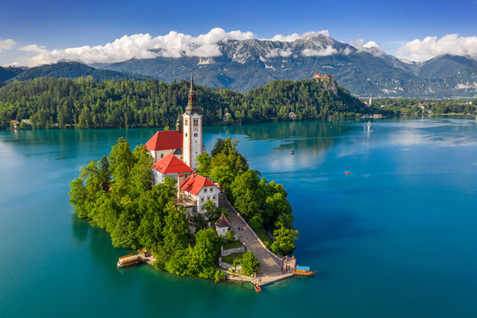

### **Day 4 – 29 Jul (Tue) – [🌍 Bovec](https://www.google.com/maps/place/Bovec,+Slovenia/)**

- [Quad Biking](https://www.quad-adventure-bovec.com/)  
- [Rafting](https://www.econaturesways.com/)  
- [Canyoning](https://www.bovec.si/en/activities/canyoning/)  
- Overnight in [Bovec](https://www.google.com/maps/place/Bovec,+Slovenia/)

  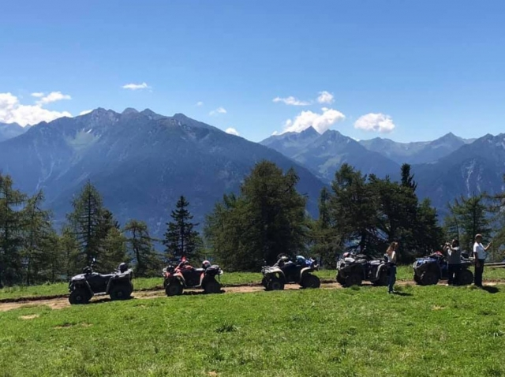
  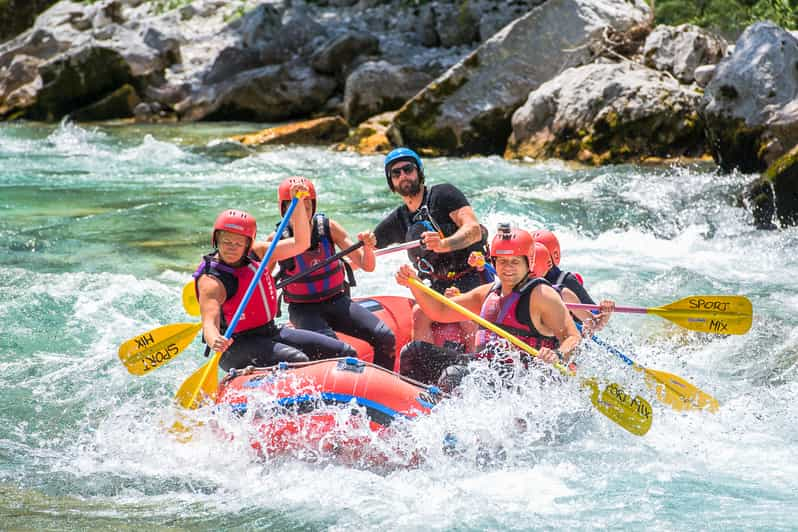

### **Day 5 – 30 Jul (Wed) – [🌍 Postojna](https://www.google.com/maps/place/Postojna,+Slovenia/) + [🌍 Trieste](https://www.google.com/maps/place/Trieste,+Italy/)**

- [Postojna Cave](https://www.postojnska-jama.eu/en/)  
- [Trieste](https://www.google.com/maps/place/Trieste,+Italy/) café & coast  
- Overnight nearby

  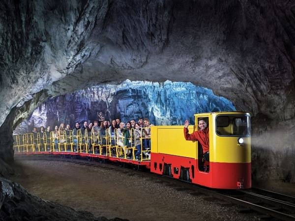
  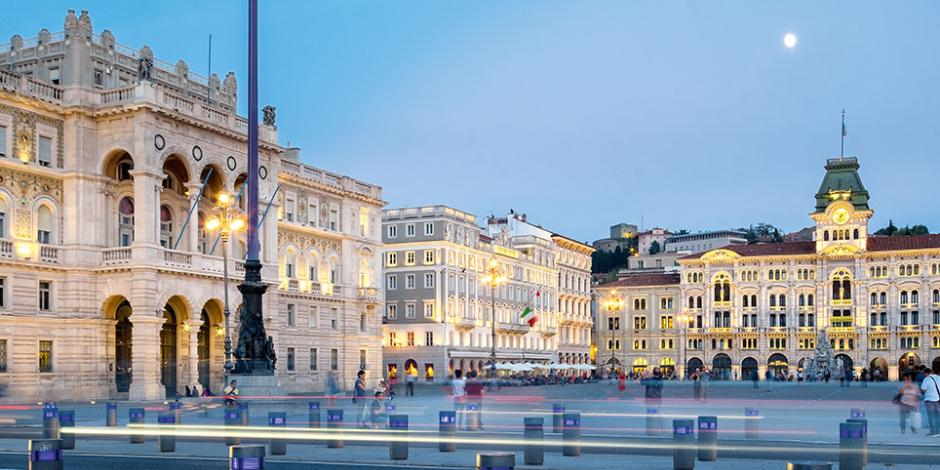

### **Day 6 – 31 Jul (Thu) – [🌍 Rovinj](https://www.google.com/maps/place/Rovinj,+Croatia/) + [🌍 Pula](https://www.google.com/maps/place/Pula,+Croatia/)**

- [Rovinj](https://www.google.com/maps/place/Rovinj,+Croatia/)  
  - Church view, old town walk  
- [Pula](https://www.google.com/maps/place/Pula,+Croatia/)  
  - Amphitheater  
  - Sunset beach chill  
- Overnight in [Pula](https://www.google.com/maps/place/Pula,+Croatia/)

  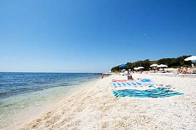
  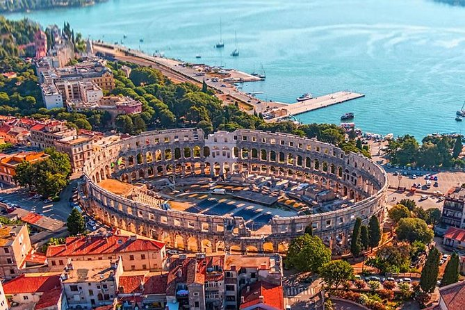

### **Day 7 – 1 Aug (Fri) – [🌍 Rijeka](https://www.google.com/maps/place/Rijeka,+Croatia/) + [🌍 Krk Island](https://www.google.com/maps/place/Krk,+Croatia/)**

- [Rijeka](https://www.google.com/maps/place/Rijeka,+Croatia/) (quick stop)  
- [Krk Island](https://www.google.com/maps/place/Krk,+Croatia/)  
  - Optional boat rental  
  - Last beach day  
- Overnight on [Krk](https://www.google.com/maps/place/Krk,+Croatia/)

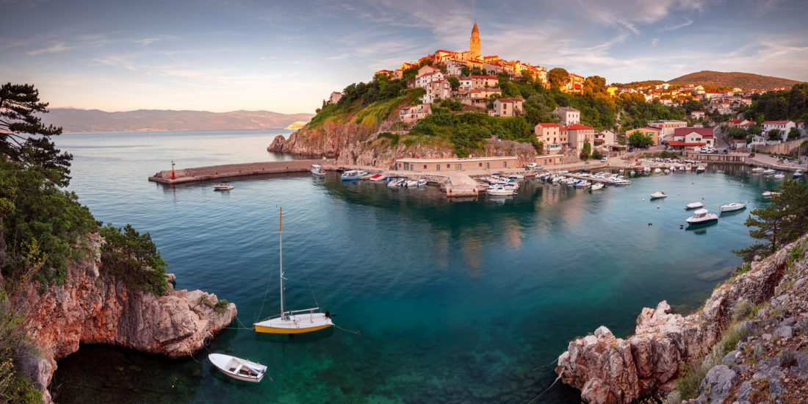

### **Day 8 – 2 Aug (Sat) – [🌍 Back to Zagreb](https://www.google.com/maps/place/Zagreb,+Croatia/)**

- Scenic inland drive  
- Return car  
- Overnight [Zagreb](https://www.google.com/maps/place/Zagreb,+Croatia/) (if needed)

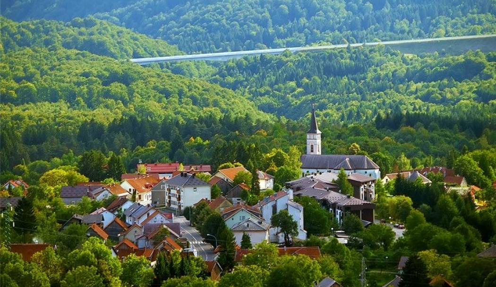

### **Day 9 – 3 Aug (Sun) – Fly Home**

- Morning in [Zagreb](https://www.google.com/maps/place/Zagreb,+Croatia/) or [Krk](https://www.google.com/maps/place/Krk,+Croatia/)  
- Morning flight to Basel

### Budget Estimate (per person)

| Item           | Amount pro P. |
|----------------|---------------|
| Flights        | ~151 CHF      |
| Rental Car     | ~162 CHF      |
| Fuel & tolls   | ~80 CHF       |
| Motels (8x)    | ~600 CHF      |
| Daily Activity | ~800 CHF      |
| Food & Drinks  | ~500 CHF      |
| **Total**      | **~2200 CHF** |

## Meeting on 25.04.25

- Clothing for different weather conditions (sunshine, rain, cold)
- 40.- per person per night
- Clubbing on the first night in Zagreb 

### Book in Advance
- Flights ✅
- Day 1: Zagreb
- Day 2: Ljubljana
- Day 9: Zagreb
- Car
- Shooting Range

### To Do
- Write email to shooting range

### Equipment
- Hiking shoes
- Swimwear
- Sports clothing
- Credit card (for Car Rental!)